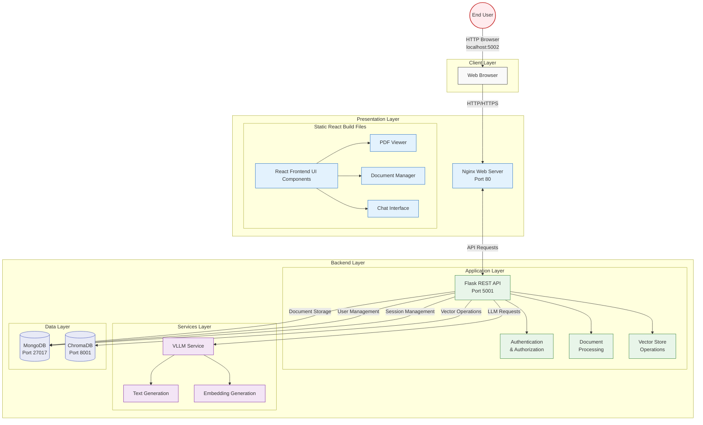

# RAG Document Manager - Sabanci University ENS491/2 Project

## Overview
A Retrieval-Augmented Generation (RAG) based document management system that enables intelligent document processing, semantic search, and AI-powered chat interactions. This project was developed as part of the ENS491 course at Sabanci University.



## Features
- 📄 Document Management
  - Upload and store documents
  - View and delete documents
  - PDF preview

- 💬 AI Chat
  - Document-aware conversations
  - Multi-language support
  - Context preservation

- 🔍 Semantic Search
  - Intelligent document retrieval
  - PDF highlighting
  - Context-aware responses

- 👤 User Management
  - Authentication
  - Role-based access
  - Session management

## System Architecture

### Components
- **Frontend**: React-based web interface
- **Backend**: Flask-based REST API
- **Database**: MongoDB for document storage
- **Vector Store**: ChromaDB for vector database to store the chunks of document embeddings.
- **LLM Integration**: We used to have Ollama for language models, and completion requests. However we sqitched to VLLM that is deployed by another group. We now do not have an ollama container in the docker-compose file.
- **Web Server**: Nginx for reverse proxy and serving the frontend.

##  Quick Start : Everything can be run using docker containers. 
To run the application:

## Quick Start

1. Clone the repository:
```bash
git clone https://github.com/idilkara/ENS492-RAGDocumentManager.gitl
cd ENS492-RAGDocumentManager
```

2. Start the services:
```bash
cd backend
docker-compose up -d
```

This command will:
- Pull required database images (MongoDB, ChromaDB)
- Build the Flask backend image
- Build the Nginx frontend image
- Start all services in containers
- Create a volume for databases and network for communication between containers.

The access point for end users is port 5002, which maps to port 80 of the Nginx container.


## Project Structure

ENS492-RAGDocumentManager/

├── backend/

│ ├── backend/ # Backend source code

│ ├── nginx/ # Nginx configuration

│ ├── build/ # Frontend build files

│ └── docker-compose.yml # Docker services configuration

├── frontend/

│ └── doc-manager-ui/ # Frontend source code

└── README.md


## Prerequisites
- Docker and Docker Compose
- Node.js (for frontend development)
- Python 3.8+ (for backend development)
- Git


### Backend (Port 5001)
- Flask REST API
- Document processing
- Vector store operations
- Authentication system

### Nginx (Port 80)
- Reverse proxy
- Static file serving
- SSL termination (if configured)

### MongoDB (Port 27017)
- Document storage
- User data
- Session management

### ChromaDB (Port 8001)
- Vector embeddings
- Semantic search
- Document indexing

## Development

### Frontend Development - see fonrtend.md for more details
```bash
cd frontend/doc-manager-ui
npm install
npm start
```

### Backend Development
```bash
cd backend/backend
pip install -r requirements.txt
flask run
```

### Building Frontend
```bash
cd frontend/doc-manager-ui
npm run build
```

#### Frontend Deployment Instructions
1. Build the React.js frontend application:
   ```bash
   cd frontend
   npm run build
   ```
2. Copy the generated `build` folder to the backend directory:
   ```bash
   cp -r build ../backend/
   ```
3. The Nginx server will automatically serve the new frontend files from the updated build folder

Note: Any time you make changes to the frontend code, you'll need to rebuild and copy over the new build folder for the changes to take effect.


## Docker Services

### Starting Services
```bash
docker-compose up -d
```

### Stopping Services
```bash
docker-compose down
```

### Viewing Logs
```bash
docker-compose logs -f
```

## Configuration

### Environment Variables
The system can be configured either through environment variables in the docker-compose manifest file or by creating a `.env` file in the backend directory. The available configuration options are defined in `config.py`.

Key configuration variables include:
- `MONGO_URI`: MongoDB connection string
- `DB_NAME`: Database name 
- `CHROMADB_URL`: ChromaDB connection URL
- `EMBEDDING_MODEL_NAME`: Name of the embedding model
- `EMBEDDING_MODEL_URL`: URL for the embedding model if it is in another server/container
- `LLM_MODEL_NAME`: LLM model name
- `TOKENIZER_NAME`: Tokenizer name
- `LLM_URI`: LLM service endpoint URL

The default configuration in `config.py` is set up for use within the Dolap server environment. Modify these values as needed for your deployment.

### Nginx Configuration
The Nginx configuration is located in `backend/nginx/nginx.conf`. This configuration handles routing and serving the frontend static files.
