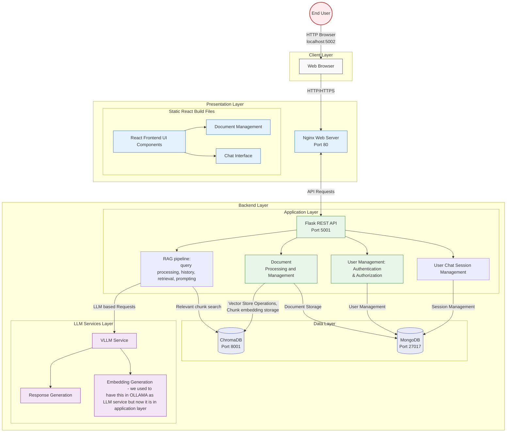

# RAG Document Manager - Sabanci University ENS491/2 Project

## Overview
A Retrieval-Augmented Generation (RAG) based document management system that enables intelligent document processing, semantic search, and AI-powered chat interactions. This project was developed as part of the ENS491 course at Sabanci University.

### For detailed documentations about components go to [documentations](documentation) folder 

The documentation folder contains detailed information about each component of the system:

- [ui.md](documentation/ui.md) - Example user interface functionalities with images
- [rag-overview.md](documentation/rag-overview.md) - Overview of the RAG implementation and key dependencies
- [rag-details.md](documentation/rag-details.md) - Detailed technical documentation of the RAG system
- [frontend.md](documentation/frontend.md) - Frontend implementation details and development guide
- [frontend-nginx.md](documentation/frontend-nginx.md) - Nginx configuration and frontend deployment guide
- [backend.md](documentation/backend.md) - Backend architecture and API documentation
- [database.md](documentation/database.md) - MongoDB database structure
- [documents.md](documentation/documents.md) - Document processing and management system details
- [instructions.md](documentation/instructions.md) - General setup and usage instructions
- [system-architecture-diagram.mermaid](documentation/system-architecture-diagram.mermaid) - System architecture in Mermaid format
- [software-archi.png](documentation/software-archi.png) - Visual representation of the software architecture

## System Architecture Diagram




## Features
- 📄 Document Management
  - Upload and store documents
  - View and delete documents
  - PDF preview

- 💬 AI Chat
  - Document-aware conversations
  - Multi-language support
  - Context preservation

- 🔍 Semantic Search
  - Intelligent document retrieval
  - PDF highlighting
  - Context-aware responses

- 👤 User Management
  - Authentication
  - Role-based access
  - Session management

## System Architecture

### Components
- **Frontend**: React-based web interface
- **Backend**: Flask-based REST API
- **Database**: MongoDB for document storage
- **Vector Store**: ChromaDB for vector database to store the chunks of document embeddings.
- **LLM Integration**: We used to have Ollama for language models, and completion requests. However we sqitched to VLLM that is deployed by another group. We now do not have an ollama container in the docker-compose file.
- **Web Server**: Nginx for reverse proxy and serving the frontend.

##  Quick Start : Everything can be run using docker containers. 
To run the application:

NOTE: (you need to have an up and runnning LLM server or change how you load the llm model in the [vector_store.py](backend/backend/vector_store.py) in backend)

1. Clone the repository:
```bash
git clone https://github.com/idilkara/ENS492-RAGDocumentManager.gitl
cd ENS492-RAGDocumentManager
```

2. Start the services:
```bash
cd backend
docker-compose up -d
```

This command will:
- Pull required database images (MongoDB, ChromaDB)
- Build the Flask backend image
- Build the Nginx frontend image
- Start all services in containers
- Create a volume for databases and network for communication between containers.

The access point for end users is port 5002, which maps to port 80 of the Nginx container.

### For deployment:

1. Clone the repository:
```bash
git clone https://github.com/your-username/ENS492-RAGDocumentManager.git
cd ENS492-RAGDocumentManager
```

2. Configure environment variables:

 You can configurethe required environment variables in docker-compose.yml file: 
 
 How we configured for deployment in @dolap server is visible in the [compose manifest](backend/docker-compose.yml).

```bash
MONGO_URI=mongodb://your-mongodb-host:27017
DB_NAME=your_database_name
CHROMADB_URL=http://your-chromadb-host:8000
LLM_URI=http://your-llm-host:8000
EMBEDDING_MODEL_NAME_V2=your-embedding-model-name
LLM_MODEL_NAME=your-llm-model-name
TOKENIZER_NAME=your-tokenizer-name
```

3. Start the services:
```bash
# Build and start all services
docker-compose up --build

# Or start in detached mode
docker-compose up -d --build

# Check service status
docker-compose ps

# View logs
docker-compose logs -f
```


4. Access the application:
- Nginx (MAIN ENTRY PORT FOR THE CLIENT): http://localhost:5002

5. Troubleshooting:
```bash
# View specific service logs
docker-compose logs -f backend
docker-compose logs -f frontend
docker-compose logs -f chromadb

# Restart specific service
docker-compose restart backend

# Stop all services
docker-compose down

# Remove all containers and volumes (! this deletes the database)
docker-compose down -v
```

## Project Structure

ENS492-RAGDocumentManager/

├── backend/ # this is the folder that is needed to have on the machine you want to start the server on

│ ├── backend/ # Backend source code

│ ├── nginx/ # Nginx configuration

│ ├── build/ # Frontend build files

│ └── docker-compose.yml # Docker services configuration

├── frontend/

│ └── doc-manager-ui/ # Frontend source code

└── README.md


## Prerequisites
- Docker and Docker Compose
- Node.js (for frontend development)
- Python 3.8+ (for backend development)
- Git

### Backend (serves at Port 5000)
- Flask REST API
- Document processing
- Vector store operations
- Authentication system

### Nginx (serves at Port 80)
- Reverse proxy
- Static file serving
- SSL termination (if configured)

### MongoDB (serves at Port 27017)
- Document storage
- User data
- Session management

### ChromaDB (serves at Port 8001)
- Vector embeddings
- Semantic search
- Document indexing

### VLLM Server (serves at port 8000)
###### We used to use Ollama (serves at port 11434 ) but we removed it, we now send requests to VLLM server. If you don't user VLLM, you can configure the software to send requests to Ollama. 
- Handles text generation and completions

## Development

### Frontend Development - see [frontend.md](documentation/frontend.md) for more details
```bash
cd frontend/doc-manager-ui
npm install
npm start
```

### Backend Development - see backend.md
```bash
cd backend/backend
pip install -r requirements.txt
flask run
```

### Building Frontend
```bash
cd frontend/doc-manager-ui
npm run build
```

#### Frontend Deployment Instructions 
1. Build the React.js frontend application:
   ```bash
   cd frontend
   npm run build
   ```
2. Copy the generated `build` folder to the backend directory:
   ```bash
   cp -r build ../backend/
   ```
3. The Nginx server will automatically serve the new frontend files from the updated build folder

Note: Any time you make changes to the frontend code, you'll need to rebuild and copy over the new build folder for the changes to take effect.


## Docker Services

### Starting Services
```bash
docker-compose up -d
```

### Stopping Services
```bash
docker-compose down
```

### Viewing Logs
```bash
docker-compose logs -f
```

## Configuration

### Environment Variables
The system can be configured either through environment variables in the docker-compose manifest file or by creating a `.env` file in the backend directory. The available configuration options are defined in `config.py`.

Key configuration variables include:
- `MONGO_URI`: MongoDB connection string
- `DB_NAME`: Database name 
- `CHROMADB_URL`: ChromaDB connection URL
- `EMBEDDING_MODEL_NAME`: Name of the embedding model
- `EMBEDDING_MODEL_URL`: URL for the embedding model if it is in another server/container
- `LLM_MODEL_NAME`: LLM model name
- `TOKENIZER_NAME`: Tokenizer name
- `LLM_URI`: LLM service endpoint URL

The default configuration in `config.py` is set up for use within the Dolap server environment. Modify these values as needed for your deployment.

### Nginx Configuration 
The Nginx configuration is located in `backend/nginx/nginx.conf`. This configuration handles routing and serving the frontend static files.

