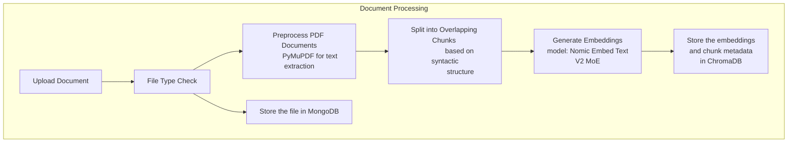
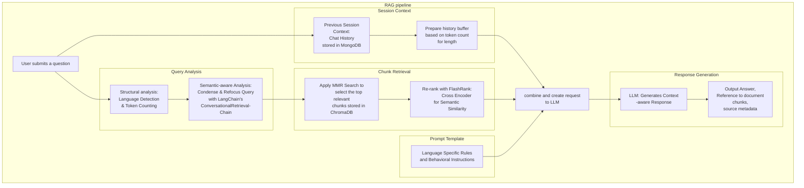

# RAG System Documentation Overview (vector_store.py)

## Overview
The RAG (Retrieval-Augmented Generation) system is implemented in `vector_store.py` and provides document processing, embedding, storage, and retrieval capabilities using ChromaDB and LangChain. For detailed version go to [rag-details.md](rag-details.md)

### Document processing



### RAG pipeline overview




## Core Components

### 1. Vector Store Setup
```python
# ChromaDB Connection
db = HttpClient(CHROMADB_URL)
vectorstore = Chroma(client=db, embedding_function=embeddings_netv2)
```

### 2. Embedding Models
The system supports two embedding models:
- **Ollama Embeddings (v1)**
  ```python
  embeddings_netv1 = OllamaEmbeddings(
      base_url=EMBEDDING_MODEL_URL, 
      model=EMBEDDING_MODEL_NAME
  )
  ```
- **HuggingFace Embeddings (v2)**
  ```python
  embeddings_netv2 = HuggingFaceEmbeddings(
      model_name=EMBEDDING_MODEL_NAME_V2,
      model_kwargs={'device': 'cpu', 'trust_remote_code': True},
      encode_kwargs={'normalize_embeddings': True}
  )
  ```

## Advanced Features

### 1. Session Memory Management
```python
class SessionMemoryManager:
    def __init__(self):
        self.sessions: Dict[str, ConversationBufferWindowMemory] = {}
```
- Maintains conversation history
- Implements window-based memory (last 3 messages)
- Supports multiple concurrent sessions

### 2. Document Chunking
- Uses semantic chunking for intelligent document splitting
- Implements fallback to RecursiveCharacterTextSplitter
- Configurable chunk size and overlap

### 3. Search Optimization
- MMR search for diverse results
- FlashRank reranking for improved relevance
- Contextual compression for better context selection

### 4. PDF Highlighting
- Integrates with PDFHighlighter for source visualization
- Supports multi-page highlighting
- Maintains document metadata

## Language Support (due to LLM limitations in Turkish fluency we do not use Turkish support but we tried it so it is left in the code for developements)

### English Prompt Template
```python
qa_prompt = PromptTemplate(
    template="""You are a knowledgeable assistant for Sabanci University..."""
)
```

### Turkish Prompt Template
```python
qa_prompt = PromptTemplate(
    template="""Sen Sabancı Üniversitesi için bilgili bir asistansın..."""
)
```

## Error Handling
- Comprehensive error handling for document processing
- Fallback mechanisms for failed operations
- Cleanup procedures for temporary files
- Graceful degradation when primary methods fail

## KEY dependencies see [requirements.txt](../backend/backend/requirements.txt)
- langchain_chroma
- langchain_community
- PyMuPDF (fitz)
- chromadb
- langchain_experimental
- langchain_huggingface


## Key Functions

### 1. Document Processing
#### `add_document(file_entry, replace_existing=False)`
- Processes and stores documents in both MongoDB and vector store
- Handles file type detection and processing
- Implements fallback mechanisms for failed processing
- Steps:
  1. File type detection
  2. Temporary file creation
  3. MongoDB storage
  4. Document chunking
  5. Vector store integration

#### `fallback_document_processing(file_path, file_extension)`
- Provides robust fallback processing when primary methods fail
- Supports PDF and text files
- Uses PyMuPDF for PDF processing
- Implements basic text extraction

### 2. Query Processing
#### `search_query(query, user_id, session_id, model, language="eng")`
- Processes user queries against stored documents
- Features:
  - Multi-language support (English/Turkish)
  - PDF highlighting
  - Source document tracking
  - Session-based memory management

#### `create_qa_chain(vectorstore, llm, session_id, language)`
- Creates a ConversationalRetrievalChain for query processing
- Implements:
  - Custom prompt templates for different languages
  - Memory management
  - MMR (Maximum Marginal Relevance) search
  - Context compression

### 3. Document Management
#### `delete_document_vectorstore(file_id)`
- Removes documents from vector store
- Handles cleanup of document chunks
- Maintains consistency between MongoDB and vector store


## Best Practices
1. **Document Processing**
   - Validate file types
   - Implement fallback mechanisms
   - Clean up temporary files
   - Handle binary content appropriately

2. **Search Optimization**
   - Use MMR for diverse results
   - Implement reranking
   - Maintain context relevance
   - Handle language-specific requirements

3. **Memory Management**
   - Clear unused sessions
   - Implement window-based memory
   - Handle concurrent sessions
   - Maintain conversation context

4. **Error Handling**
   - Implement comprehensive error catching
   - Provide meaningful error messages
   - Clean up resources on failure
   - Maintain system consistency