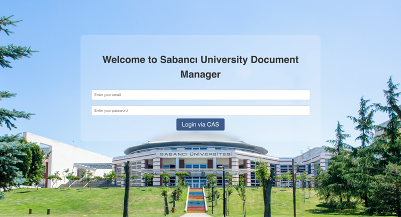
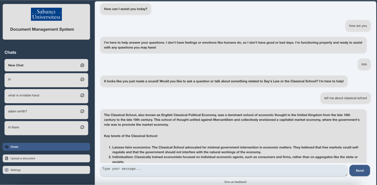
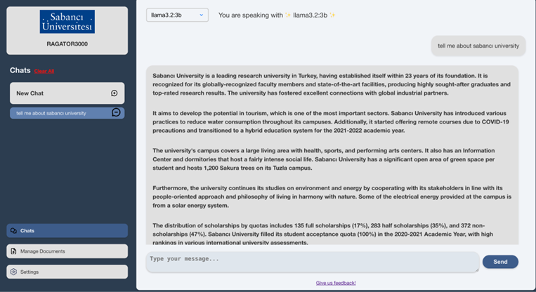
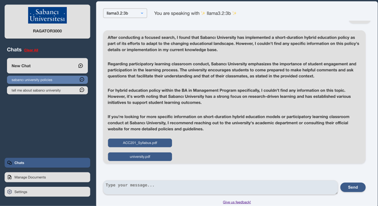
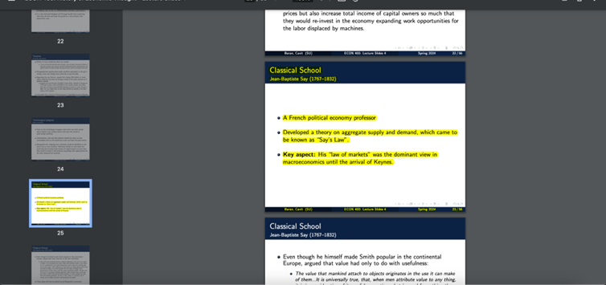
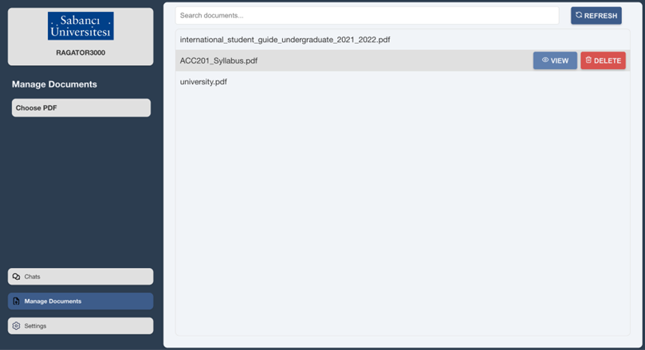
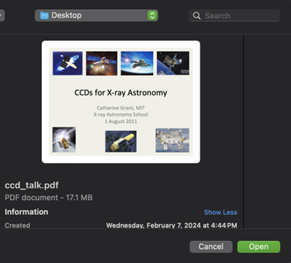
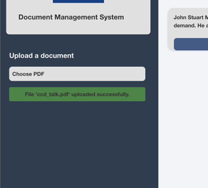

# User Interface Features and example images

NOTE: we had to change some fatures of the software throughtout the process so there may be some inconsistencies in the ui based on the time we took the images but the key functionalities are still relevant to the documentation and the latest version. For example, we added LLM model selection and then removed it so some images has it some do not. 

## Authentication
### *   Sign up with email validation (only @sabanciuniv.ed users are allowed)
### *   Login with secure authentication
### *   Log out function in settings panel

# Chat Interface

## Chat Session Management: 
### *   Create new chat sessions

### *   Delete existing sessions

### *   Access to older conversations

## Document References

### *   Responses include relevant PDF sources

### *   Click on sources to open PDF viewer
### *   Automatic page navigation to referenced content
### *   Text highlighting for relevant passages

## Document Management

### *    View or delete uploaded documents

### *   Upload new documents (PDF)

